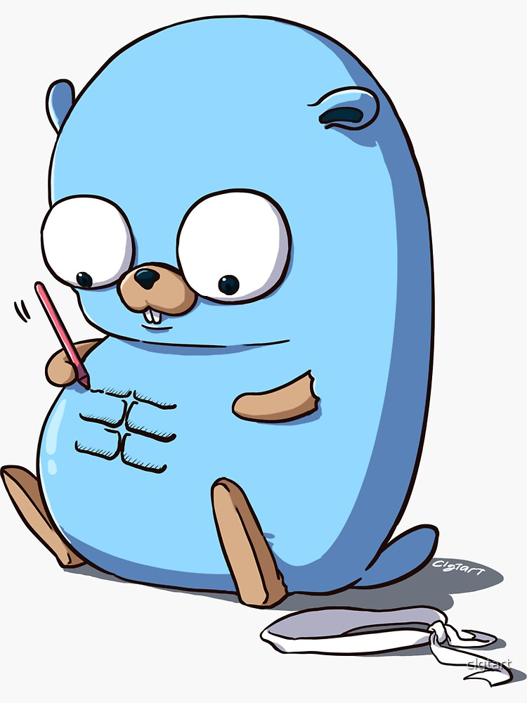

# My Go Examples

Algunos ejemplos sobre tutoriales y ejercicios en Go.

## Summary

* [Condicionales e Iteradores](https://github.com/javierlopezdeancos/my-go-examples/blob/master/example-ifelse-iterations/ifelse-iterators.md)
  * [Condicionales](https://github.com/javierlopezdeancos/my-go-examples/blob/master/example-ifelse-iterations/ifelse-iterators.md#1-condicionales)
    * [Condicional if](https://github.com/javierlopezdeancos/my-go-examples/blob/master/example-ifelse-iterations/ifelse-iterators.md#11-condicional-if)
    * [Condicional if-else](https://github.com/javierlopezdeancos/my-go-examples/blob/master/example-ifelse-iterations/ifelse-iterators.md#12-condicional-if-else)
    * [Condicional if else if](https://github.com/javierlopezdeancos/my-go-examples/blob/master/example-ifelse-iterations/ifelse-iterators.md#13-condicional-if-else-if)
      * [Estado inicial](https://github.com/javierlopezdeancos/my-go-examples/blob/master/example-ifelse-iterations/ifelse-iterators.md#131-estado-inicial)
      * Ternary condition
    * [Condicional switch](https://github.com/javierlopezdeancos/my-go-examples/blob/master/example-ifelse-iterations/ifelse-iterators.md#14-condicional-switch)
      * The syntax of the switch statement
      * [Default case](https://github.com/javierlopezdeancos/my-go-examples/blob/master/example-ifelse-iterations/ifelse-iterators.md#141-default-case)
      * [Múltiples valores en el case](https://github.com/javierlopezdeancos/my-go-examples/blob/master/example-ifelse-iterations/ifelse-iterators.md#142-multiples-valores-en-el-case)
      * [Inicial statement](https://github.com/javierlopezdeancos/my-go-examples/blob/master/example-ifelse-iterations/ifelse-iterators.md#143-inicial-statement)
      * [Expressionless switch statement](https://github.com/javierlopezdeancos/my-go-examples/blob/master/example-ifelse-iterations/ifelse-iterators.md#144-expressionless-switch-statement)
      * [Fallthrough statement](https://github.com/javierlopezdeancos/my-go-examples/blob/master/example-ifelse-iterations/ifelse-iterators.md#145-fallthrough-statement)
  * [Iteradores](https://github.com/javierlopezdeancos/my-go-examples/blob/master/example-ifelse-iterations/ifelse-iterators.md#2-Iteradores)
    * [Bucles for](https://github.com/javierlopezdeancos/my-go-examples/blob/master/example-ifelse-iterations/ifelse-iterators.md#21-bucles-for)
      * [Sintaxis del bucle for](https://github.com/javierlopezdeancos/my-go-examples/blob/master/example-ifelse-iterations/ifelse-iterators.md#211-sintaxis-del-bucle-for)
      * [Variantes del bucle for](https://github.com/javierlopezdeancos/my-go-examples/blob/master/example-ifelse-iterations/ifelse-iterators.md#212-variantes-del-bucle-for)
        * [Opcional init statment](https://github.com/javierlopezdeancos/my-go-examples/blob/master/example-ifelse-iterations/ifelse-iterators.md#2121-opcional-init-statment)
        * [Opcional post statment](https://github.com/javierlopezdeancos/my-go-examples/blob/master/example-ifelse-iterations/ifelse-iterators.md#2122-opcional-post-statment)
        * [Opcional init y statment](https://github.com/javierlopezdeancos/my-go-examples/blob/master/example-ifelse-iterations/ifelse-iterators.md#2123-opcional-init-y-post-statment)
        * [Sin ningún statment](https://github.com/javierlopezdeancos/my-go-examples/blob/master/example-ifelse-iterations/ifelse-iterators.md#2124-sin-ningun-statment)
        * [El break statment](https://github.com/javierlopezdeancos/my-go-examples/blob/master/example-ifelse-iterations/ifelse-iterators.md#2125-el-break-statement)
        * [El continue statment](https://github.com/javierlopezdeancos/my-go-examples/blob/master/example-ifelse-iterations/ifelse-iterators.md#2126-el-continue-statement)
        * [El return statment](https://github.com/javierlopezdeancos/my-go-examples/blob/master/example-ifelse-iterations/ifelse-iterators.md#2127-el-return-statement)
        * [Range](https://github.com/javierlopezdeancos/my-go-examples/blob/master/example-ifelse-iterations/ifelse-iterators.md#2128-range)
          * [Range sobre un array](https://github.com/javierlopezdeancos/my-go-examples/blob/master/example-ifelse-iterations/ifelse-iterators.md#21281-range-sobre-un-array)
          * [Range sobre un map](https://github.com/javierlopezdeancos/my-go-examples/blob/master/example-ifelse-iterations/ifelse-iterators.md#21282-range-sobre-un-map)
            * [Range sobre un map usando keys](https://github.com/javierlopezdeancos/my-go-examples/blob/master/example-ifelse-iterations/ifelse-iterators.md#212821-range-sobre-un-map-usando-keys)
            * [Range sobre un map usando key value](https://github.com/javierlopezdeancos/my-go-examples/blob/master/example-ifelse-iterations/ifelse-iterators.md#212822-range-sobre-un-map-usando-key-value)
* [Structures in Go (structs)](https://medium.com/rungo/structures-in-go-76377cc106a2)
  * Declaring a struct type
  * Creating a struct
    * Getting and setting struct fields
  * Initializing a struct
  * Anonymous struct
  * Pointer to a struct
  * Anonymous fields
  * Nested struct
  * Promoted fields
  * Nested interface
  * Exported fields
  * Function fields
  * Struct comparison
  * Struct field meta-data
* [The anatomy of Functions in Go](https://medium.com/rungo/the-anatomy-of-functions-in-go-de56c050fe11)
  * What is a function
  * Function name convention
  * Function parameters
  * Return value
  * Multiple return values
* [Anatomy of methods in Go](https://medium.com/rungo/anatomy-of-methods-in-go-f552aaa8ac4a)
  * What is a method?
  * Methods with the same name
  * Pointer receivers
    * Calling methods with pointer receiver on values
  * Methods on nested struct
    * Methods on nested struct
    * Anonymously nested struct
    * Promoted methods
  * Methods can accept both pointer and value
  * Methods on non-struct type
* [Interfaces in Go](https://medium.com/rungo/interfaces-in-go-ab1601159b3a)
  * What is an interface?
  * Declaring interface
  * Implementing interface
  * Empty interface
  * Multiple interfaces
  * Type assertion
  * Type switch
  * Embedding interfaces
  * Pointer vs Value receiver
  * Interface comparison
  * Use of interfaces
* [Introduction to Streams and Buffers](https://medium.com/rungo/introduction-to-streams-and-buffers-d148c0cda0ad)
  * What are a stream and a buffer
  * Reading from a Data Source
    * io.Reader
    * strings.NewReader
    * ioutil.ReadAll
    * io.ReadFull
    * io.LimitReader
  * Writing to a Data Store
    * io.Writer
    * io.WriteString
    * Standard I/O Streams
  * Closing I/O Operations
  * Transferring Data between streams
    * io.Copy
    * io.Pipe
  * Buffered streams
* [Trabajando con JSON](https://github.com/javierlopezdeancos/my-go-examples/blob/master/example-work-with-json/work-with-json.md#trabajando-con-json)
  * [Referencias](https://github.com/javierlopezdeancos/my-go-examples/blob/master/example-work-with-json/work-with-json.md#referencias)
  * [Introducción](https://github.com/javierlopezdeancos/my-go-examples/blob/master/example-work-with-json/work-with-json.md#introduccion)
  * [Codificando JSON](https://github.com/javierlopezdeancos/my-go-examples/blob/master/example-work-with-json/work-with-json.md#codificando-json)
    * [Manejo de tipos de datos](https://github.com/javierlopezdeancos/my-go-examples/blob/master/example-work-with-json/work-with-json.md#manejo-de-tipos-de-datos)
    * [Tipos de datos abstractos](https://github.com/javierlopezdeancos/my-go-examples/blob/master/example-work-with-json/work-with-json.md#tipos-de-datos-abstractos)
    * [Conversión de tipos de datos](https://github.com/javierlopezdeancos/my-go-examples/blob/master/example-work-with-json/work-with-json.md#conversion-de-tipos-de-datos)
    * [Codificando usando structure tags](https://github.com/javierlopezdeancos/my-go-examples/blob/master/example-work-with-json/work-with-json.md#codificando-usando-structure-tags)
    * [Codificar trabajando con maps](https://github.com/javierlopezdeancos/my-go-examples/blob/master/example-work-with-json/work-with-json.md#codificar-trabajando-con-maps)
  * [Decodificando JSON](https://github.com/javierlopezdeancos/my-go-examples/blob/master/example-work-with-json/work-with-json.md#decodificando-json)
    * [Manejando estructuras de datos complejas](https://github.com/javierlopezdeancos/my-go-examples/blob/master/example-work-with-json/work-with-json.md#manejando-estructuras-de-datos-complejas)
    * [Campos promocionados](https://github.com/javierlopezdeancos/my-go-examples/blob/master/example-work-with-json/work-with-json.md#campos-promocionados)
    * [Decodificando usando structure tags](https://github.com/javierlopezdeancos/my-go-examples/blob/master/example-work-with-json/work-with-json.md#decodificando-usando-structure-tags)
    * [Decodificar trabajando con maps](https://github.com/javierlopezdeancos/my-go-examples/blob/master/example-work-with-json/work-with-json.md#decodificar-trabajando-con-maps)
    * [Usando Unmarshaler and TextUnmarshaler](https://github.com/javierlopezdeancos/my-go-examples/blob/master/example-work-with-json/work-with-json.md#usando-unmarshaler-and-textunmarshaler)
  * [Codificador y Decodificador](https://github.com/javierlopezdeancos/my-go-examples/blob/master/example-work-with-json/work-with-json.md#codificador-y-decodificador)
    * [Codificador](https://github.com/javierlopezdeancos/my-go-examples/blob/master/example-work-with-json/work-with-json.md#codificador)
    * [Decodificador](https://github.com/javierlopezdeancos/my-go-examples/blob/master/example-work-with-json/work-with-json.md#codificador)
* Katas
  [Leap Year](./katas/leapyear/leapyear.md)
  [String Calculator](./katas/stringcalculator/stringcalculator.md)
