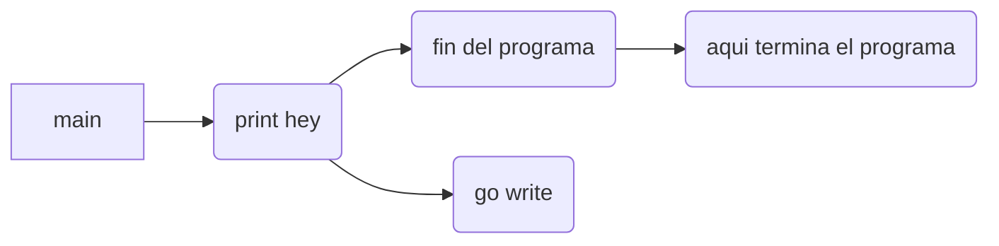
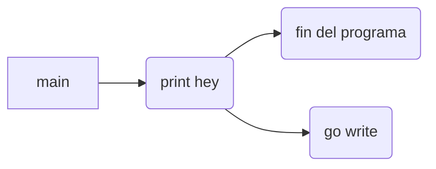
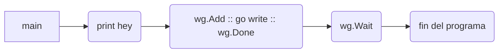

- [Goroutines en Go](#1-goroutines-en-go)
  - [Introducción](#11-introducci%C3%B3n)
  - [Corrutinas en Go](#12-corrutinas-en-go)
  - [WaitGroups en Go](#13-waitgroups-en-go)
    - [El método Add](#131-el-m%C3%A9todo-add)
    - [El Método Done](#132-el-m%C3%A9todo-done)
  - [Funciones anónimas en goroutines](#14-funciones-an%C3%B3nimas-en-goroutines)
- [References](#2-references)

# 1. Goroutines en Go

## 1.1 Introducción

Go es un lenguaje especializado en la concurrencia . Es un lenguaje que fue diseñado para manejar múltiples tareas de manera asíncrona. Esta entrada trata sobre los channels o canales de go.

Antes de empezar, recuerda que paralelismo y concurrencia son diferentes.

Podríamos decir que **un programa es concurrente si puede soportar dos o más acciones en progreso**.

Por otro lado, **un programa es paralelo si puede soportar dos o más acciones ejecutándose simultáneamente**.

## 1.2 Corrutinas en Go

Una corrutina , en go, es una función o método que se ejecuta concurrentemente junto con otras funciones o métodos. En go, a las corrutinas se les conoce como goroutines o gorutinas. Incluso, la función principal, main, se ejecuta dentro de una.

Para generar una goroutine **agregamos el keyword go antes de una función**. Lo anterior programará la función para su ejecución asíncrona.

```go
package main

func write(texto string) {
  fmt.Println(texto)
}

func main() {
  fmt.Println("hey")
  go write("hey again")
}
```

En el caso anterior, debido a su naturaleza asíncrona, la goroutine no detiene la ejecución del código. Lo anterior implica que el cuerpo de la función main continua su ejecución y nuestra goroutine nunca llega a ejecutarse.



Siendo el output:

```text
hey
```

El programa termina antes de que la goroutine se ejecute.

¿Pero entonces? ¿cómo hacemos para que nuestra goroutine se ejecute? La aproximación ingenua sería usar un sleep para pausar la ejecución del código. Esto, como ya sabes, es un sinsentido. ¡No use un sleep!

```go
// NO LO HAGAS
time.Sleep(1 * time.Second)
```

Una mejor aproximación sería crear un WaitGroup o grupo de espera.

## 1.3 WaitGroups en Go

Un WaitGroup detendrá la ejecución del programa y esperará a que se ejecuten las goroutines.

Internamente, un WaitGroup funciona con un contador, cuando el contador esté en cero la ejecución del código continuará, mientras que si el contador es mayor a cero, esperará a que se terminen de ejecutar las demás goroutines.

```go
package main

import (
 "fmt"
 "sync"
)

func main() {
 var wg sync.WaitGroup

 wg.Wait()
 fmt.Println("Si el contador del waitgroup es mayor que cero se continuará con esta función.")
}
```

siendo su output

```text
Si el contador del waitgroup es mayor que cero se continuará con esta función.
```

[En el ejemplo en vivo](https://go.dev/play/p/3rcda_EVL-R)

¿Pero como deberíamos cambiar el valor del contador?

Go dispone para nosotros de dos métodos para este propósito, para **incrementar y decrementar el contador del WaitGroup usaremos los métodos `Add` y `Done`**, respectivamente.

### 1.3.1 El método Add

El método `Add` incrementa el contador del WaitGroup en n unidades, donde n es el argumento que le pasamos.

El truco está en **llamarlo cada vez que ejecutemos una goroutine**.

```diff
package main

import (
  "fmt"
+ "sync"
)

func write(texto string) {
  fmt.Println(texto)
}

func main() {
+ var wg sync.WaitGroup

  fmt.Println("hey")

+ wg.Add(1)
  go write("hey again")

+ wg.Wait()
}
```

### 1.3.2 El Método Done

El método `Done` se encarga de disminuir una unidad del contador del WaitGroup. Lo llamaremos para avisarle al WaitGroup que la goroutine ha finalizado y decremente el contador en uno.

```diff
-func write(texto string) {
+func write(texto string, wg *sync.WaitGroup) {
  fmt.Println(texto)
+ wg.Done()
}
```

> [!IMPORTANT]
> Recuerda que la instancia del WaitGroup (wg *) necesita pasarse por referencia o de otra manera no accederemos al WaitGroup original.

```diff
-func write(texto string) {
+func write(texto string, wg *sync.WaitGroup) {
  fmt.Println(texto)
+ defer wg.Done()
}
```

> [!TIP]
> Usa defer sobre el método Done para garantizar que sea lo último que se ejecute.



Siendo el código definitivo

```go
package main

import (
  "fmt"
  "sync"
)

func write(texto string, wg *sync.WaitGroup) {
  fmt.Println(texto)
  defer wg.Done()
}

func main() {
  var wg sync.WaitGroup

  fmt.Println("hey")

  wg.Add(1)
  go write("hey again", &wg)

  wg.Wait()
}
```

Siendo el output

```text
hey
hey again
```

[En el ejemplo en vivo](https://go.dev/play/p/1YpQ3VQTs6e)

En este ejemplo si que `Wait` se espera a que se terminen de ejecutar todas las goroutines.



Una vez que el contador de wg.Wait se vuelve cero, se continua la ejecución del programa.

```go
var wg sync.WaitGroup
wg.Add(1)
go escribirEnCanal("Ge", &wg)
wg.Wait()
```

## 1.4 Funciones anónimas en goroutines

Cuando se usan gorutinas, es bastante común utilizar funciones anónimas para evitar declarar una función nueva.

```go
go func() {
}()
```

Recuerda que los paréntesis que aparecen tras el cuerpo de la función ejecutan la función anónima que declaramos y también reciben sus argumentos.

```go
go func(text string) {
}("Texto")
```

# 2. References

[Introduccion a las goroutines y concurrencia](https://coffeebytes.dev/es/go-introduccion-a-las-goroutines-y-concurrencia/)

[Goroutines en golanbot](https://golangbot.com/goroutines/)

[Goroutines por google devs](https://www.youtube.com/watch?v=f6kdp27TYZs)
